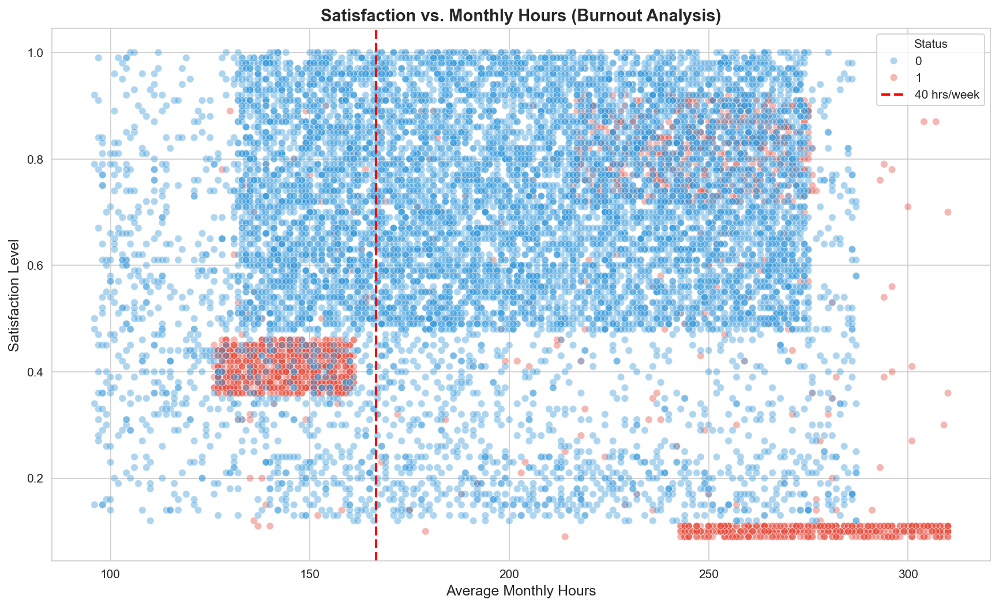
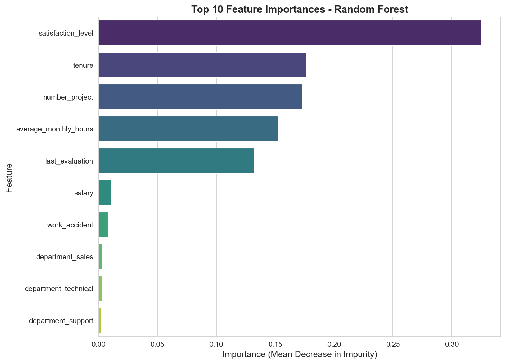
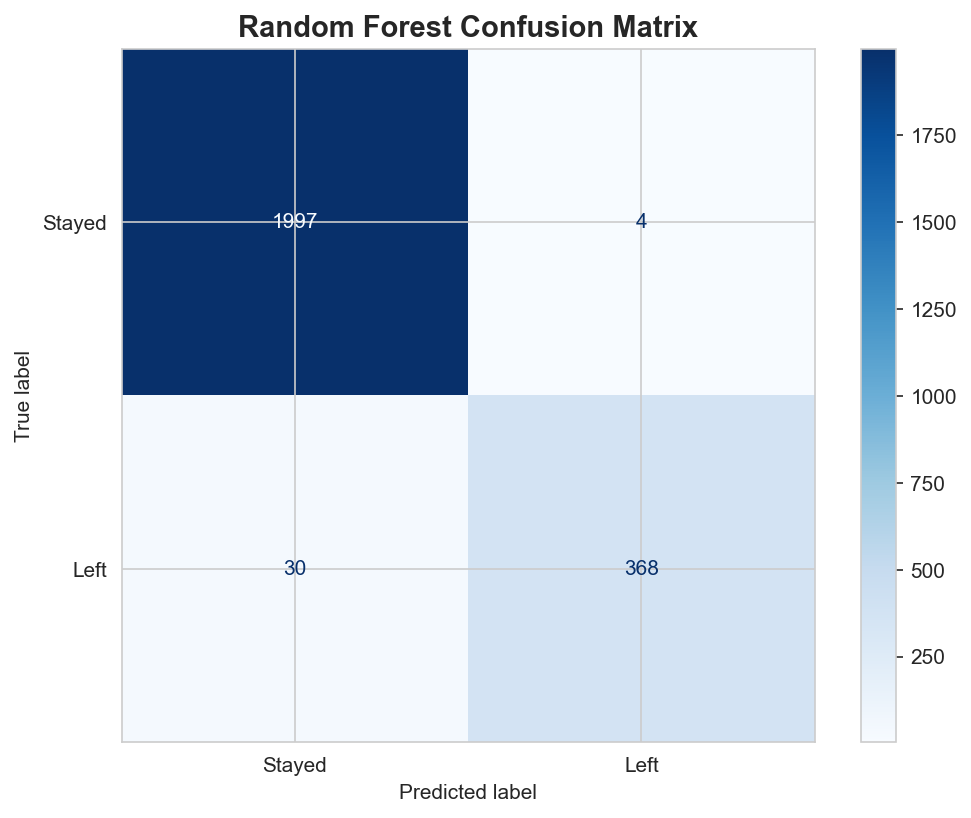
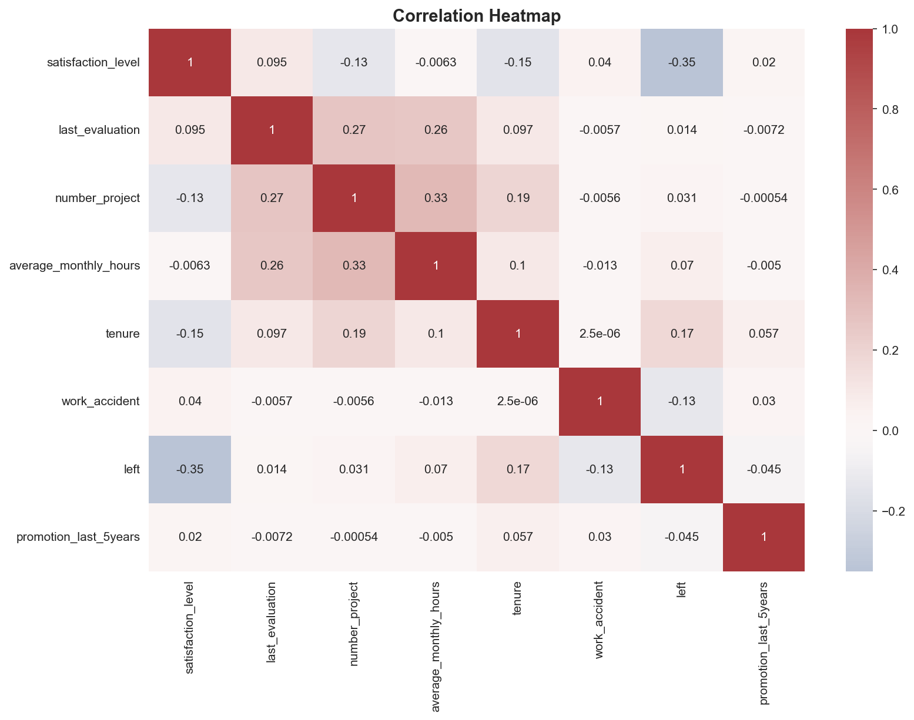

# Salifort Motors: Predictive Employee Turnover Modeling

### Strategic Workforce Analytics using Machine Learning

[]
[](https://www.coursera.org/professional-certificates/google-advanced-data-analytics)
[](https://www.coursera.org/account/accomplishments/professional-cert/4TAGPANB8CD8)

[](https://python.org)
[](https://scikit-learn.org)
[](LICENSE)

---

> **Google Advanced Data Analytics Professional Certificate - Capstone Project**
> 
> This project is the final capstone for the [Google Advanced Data Analytics Professional Certificate](https://www.coursera.org/professional-certificates/google-advanced-data-analytics) on Coursera. It demonstrates end-to-end data science skills including exploratory data analysis, statistical modeling, machine learning, and stakeholder communication using the **PACE framework** (Plan, Analyze, Construct, Execute).

---

## Executive Summary

Employee turnover costs companies **50-200% of an employee's annual salary** in recruitment, training, and lost productivity. This project addresses this critical business challenge for Salifort Motors by developing a machine learning solution to identify at risk employees before they resign.

**The final Random Forest model achieved 92.5% Recall**, enabling HR to proactively intervene with high performing individuals *before* they leave potentially saving hundreds of thousands in annual recruitment costs.

### Key Results at a Glance

| Metric | Value |
|--------|-------|
| **Model Recall** | 92.5% (catches 92.5% of employees who will leave) |
| **Model Precision** | 98.9% (predictions are highly accurate) |
| **F1 Score** | 95.6% |
| **Top Predictor** | Satisfaction Level (32.5% importance) |

---

## Key Insights & Visualizations

### 1. The Burnout Cluster

A critical discovery: **high performing employees working 250+ hours/month are leaving at alarming rates**, even with strong evaluation scores. This "burnout cluster" represents the company's most valuable talent silently burning out.



### 2. Feature Importance: What Drives Turnover?

The Random Forest model identified the top predictors of employee attrition:

1. **Satisfaction Level** (32.5%) - The strongest indicator of turnover risk
2. **Tenure** (17.6%) - Highlights the critical 3-5 year danger zone
3. **Number of Projects** (17.4%) - Too few or too many projects increases risk
4. **Average Monthly Hours** (15.3%) - Identifies overworked employees
5. **Last Evaluation** (13.3%) - High performers are also at risk



### 3. Model Performance: Confusion Matrix

The Random Forest model correctly identifies the vast majority of at risk employees while maintaining high precision (few false alarms).



### 4. Correlation Analysis

Understanding relationships between variables guided feature selection and revealed multicollinearity considerations.



### 5. Turnover by Department

Turnover patterns across departments help HR target interventions where they're needed most.


---

## The PACE Strategy Framework

This project follows the **PACE** methodology taught in the Google Advanced Data Analytics Certificate:

### 1. Plan
- **Stakeholder Alignment:** Identified HR and Executive Leadership as primary stakeholders
- **Goal Setting:** Predict employee churn (binary classification) to improve retention rates
- **Ethics & Privacy:** Established guardrails ensuring predictions support employees rather than penalize them

### 2. Analyze (EDA)
- **Data Cleaning:** Removed 3,008 duplicate entries and standardized column names
- **Outlier Analysis:** Identified 824 tenure outliers representing long tenured employees
- **Key Discovery:** Found the "Burnout Cluster"—high performers working excessive hours who are leaving

### 3. Construct (Modeling)
- **Baseline Model:** Logistic Regression achieved only 18.3% Recall (missed 82% of leavers)
- **Champion Model:** Random Forest captured non-linear patterns with 92.5% Recall
- **Metric Priority:** Focused on Recall and F1-Score to minimize false negatives

### 4. Execute (Recommendations)
Delivered actionable insights to HR leadership (see Business Recommendations below)

---

## Model Performance Comparison

| Model | Accuracy | Precision | Recall | F1 Score | ROC-AUC |
|:------|:--------:|:---------:|:------:|:--------:|:-------:|
| Logistic Regression | 83.4% | 49.7% | 18.6% | 0.27 | 0.84 |
| **Random Forest (Champion)** | **98.6%** | **98.9%** | **92.5%** | **0.96** | **0.98** |

**Why Random Forest won:** The data exhibited non-linear relationships (U-shaped project risk, burnout clusters) that Logistic Regression couldn't capture. Random Forest naturally handles these complex interactions.

---

## Business Recommendations

Based on the model's findings, I recommend the following interventions:

| Priority | Recommendation | Rationale |
|:--------:|----------------|-----------|
| **High** | Cap workloads at **5 concurrent projects** | Employees with 6+ projects leave at significantly higher rates |
| **High** | Flag employees working **250+ hrs/month** | Trigger immediate manager "stay interviews" for overworked high-performers |
| **Medium** | Implement **"3-5 Year" development program** | Turnover peaks at this tenure; offer career advancement opportunities |
| **Medium** | Review **low/medium salary bands** | These groups show disproportionately high turnover |

---

## Technical Stack

| Category | Tools |
|----------|-------|
| **Language** | Python 3.8+ |
| **Data Manipulation** | Pandas, NumPy |
| **Machine Learning** | Scikit-learn (Logistic Regression, Random Forest) |
| **Visualization** | Matplotlib, Seaborn |
| **Framework** | PACE (Plan, Analyze, Construct, Execute) |
| **Development** | Jupyter Notebook, VS Code |

---

## Repository Structure

```
salifort-motors-hr-analytics/
│
├── figures/                          # Generated visualizations
│   ├── burnout_cluster.png
│   ├── confusion_matrix.png
│   ├── correlation_heatmap.png
│   ├── feature_importance.png
│   └── turnover_by_department.png
│
├── hr_turnover_predictor.py          # Production-ready ML pipeline
├── Salifort_Motors_HR_Analytics.ipynb # Full EDA & analysis notebook
├── requirements.txt                   # Python dependencies
├── LICENSE                            # MIT License
├── .gitignore                         # Git ignore rules
└── README.md                          # This file
```

### File Descriptions

| File | Description |
|------|-------------|
| [`hr_turnover_predictor.py`](hr_turnover_predictor.py) | Production-ready Python script with modular classes for data processing, model training, and visualization. Run this to reproduce all results. |
| [`Salifort_Motors_HR_Analytics.ipynb`](Salifort_Motors_HR_Analytics.ipynb) | Jupyter notebook containing the complete PACE analysis, EDA visualizations, and model development process. |
| [`requirements.txt`](requirements.txt) | Python package dependencies for reproducing the environment. |
| [`figures/`](figures/) | All generated visualizations used in this README and for presentations. |

---

## Getting Started

### Prerequisites
- Python 3.8 or higher
- pip package manager

### Installation

1. **Clone the repository:**
   ```bash
   git clone https://github.com/YOUR_USERNAME/salifort-motors-hr-analytics.git
   cd salifort-motors-hr-analytics
   ```

2. **Install dependencies:**
   ```bash
   pip install -r requirements.txt
   ```

3. **Run the analysis:**
   ```bash
   # Run the production pipeline (requires HR_capstone_dataset.csv)
   python hr_turnover_predictor.py
   ```

4. **View the full analysis:**
   Open `Salifort_Motors_HR_Analytics.ipynb` in Jupyter Lab or VS Code.

### Data

The dataset used in this project is from [Kaggle's HR Analytics dataset](https://www.kaggle.com/datasets/mfaisalqureshi/hr-analytics-and-job-prediction). Place the CSV file in the same directory as the script to run the pipeline.

---

## AI-Augmented Workflow

This project utilized an **AI-augmented development workflow** to enhance productivity:

- **Code Refactoring:** Transformed raw Jupyter notebook code into production-ready, modular Python classes
- **Documentation:** AI-assisted generation of comprehensive docstrings and README content
- **Debugging:** Leveraged AI for troubleshooting complex syntax and optimizing visualizations
- **Best Practices:** Applied clean code principles including type hints, logging, and error handling

This approach demonstrates proficiency in leveraging modern AI tools to accelerate data science workflows while maintaining code quality.

---

## License

This project is licensed under the MIT License - see the [LICENSE](LICENSE) file for details.

---

## Acknowledgments

- **[Google Advanced Data Analytics Professional Certificate](https://www.coursera.org/professional-certificates/google-advanced-data-analytics)** - This capstone project was completed as the final requirement for the 7-course certificate program, which covers foundations of data science, statistics, Python, regression analysis, and machine learning. [View my certificate](https://www.coursera.org/account/accomplishments/professional-cert/4TAGPANB8CD8)
- **Kaggle** - For providing the HR Analytics dataset
- **Anthropic Claude** - AI assistance for code refactoring and documentation

---

## Connect

**Kyle Ware**  
*Aspiring Data Scientist | Machine Learning Enthusiast*

[](https://linkedin.com/in/kyleaware)
[](https://github.com/KyleWareEng)

